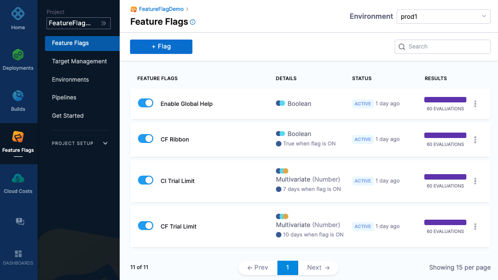

Golang SDK For Harness Feature Flags
========================

[](https://goreportcard.com/report/github.com/drone/ff-golang-server-sdk)

## Table of Contents
**[Intro](#Intro)**<br>
**[Requirements](#Requirements)**<br>
**[Quickstart](#Quickstart)**<br>
**[Further Reading](docs/further_reading.md)**<br>
**[Build Instructions](docs/build.md)**<br>


## Intro
Use this README to get started with our Feature Flags (FF) SDK for Golang. This guide outlines the basics of getting started with the SDK and provides a full code sample for you to try out.
This sample doesn’t include configuration options, for in depth steps and configuring the SDK, for example, disabling streaming or using our Relay Proxy, see the  [Golang SDK Reference](https://ngdocs.harness.io/article/4c8wljx60w-feature-flag-sdks-go-application).

For a sample FF Golang SDK project, see our [test Golang project](examples/getting_started.go).



## Requirements
[Golang 1.6](https://go.dev/doc/install) or newer (go version)<br>

## Quickstart
To follow along with our test code sample, make sure you’ve:

- [Created a Feature Flag on the Harness Platform](https://ngdocs.harness.io/article/1j7pdkqh7j-create-a-feature-flag) called harnessappdemodarkmode
- [Created a server SDK key and made a copy of it](https://ngdocs.harness.io/article/1j7pdkqh7j-create-a-feature-flag#step_3_create_an_sdk_key)


### Install the SDK
Install the golang SDK using go
```golang
go get github.com/harness/ff-golang-server-sdk
```

### Code Sample
The following is a complete code example that you can use to test the harnessappdemodarkmode Flag you created on the Harness Platform. When you run the code it will:
- Connect to the FF service.
- Report the value of the Flag every 10 seconds until the connection is closed. Every time the harnessappdemodarkmode Flag is toggled on or off on the Harness Platform, the updated value is reported. 
- Close the SDK.


```go
package main

import (
	"log"
	"os"
	"time"

	harness "github.com/harness/ff-golang-server-sdk/client"
	"github.com/harness/ff-golang-server-sdk/evaluation"
)

var (
	flagName string = getEnvOrDefault("FF_FLAG_NAME", "harnessappdemodarkmode")
	apiKey   string = getEnvOrDefault("FF_API_KEY", "changeme")
)

func main() {
	log.Println("Harness SDK Getting Started")

	// Create a feature flag client
	client, err := harness.NewCfClient(apiKey)
	if err != nil {
		log.Fatalf("could not connect to CF servers %s\n", err)
	}
	defer func() { client.Close() }()

	// Create a target (different targets can get different results based on rules)
	target := evaluation.Target{
		Identifier: "golangsdk",
		Name:       "GolangSDK",
		Attributes: &map[string]interface{}{"location": "emea"},
	}

	// Loop forever reporting the state of the flag
	for {
		resultBool, err := client.BoolVariation(flagName, &target, false)
		if err != nil {
			log.Fatal("failed to get evaluation: ", err)
		}
		log.Printf("Flag variation %v\n", resultBool)
		time.Sleep(10 * time.Second)
	}

}

func getEnvOrDefault(key, defaultStr string) string {
	value := os.Getenv(key)
	if value == "" {
		return defaultStr
	}
	return value
}
```

### Running the example

```bash
export FF_API_KEY=<your key here>
go run examples/getting_started.go
```

### Running the example with Docker
If you dont have the right version of golang installed locally, or don't want to install the dependencies you can
use docker to quick get started

```bash 
export FF_API_KEY=<your key here>
docker run -e FF_API_KEY=$FF_API_KEY -v $(pwd):/app -w /app golang:1.17 go run examples/getting_started.go
```

### Additional Reading

For further examples and config options, see the [Golang SDK Reference](https://ngdocs.harness.io/article/4c8wljx60w-feature-flag-sdks-go-application).

For more information about Feature Flags, see our [Feature Flags documentation](https://ngdocs.harness.io/article/0a2u2ppp8s-getting-started-with-feature-flags).

-------------------------
[Harness](https://www.harness.io/) is a feature management platform that helps teams to build better software and to
test features quicker.

-------------------------
